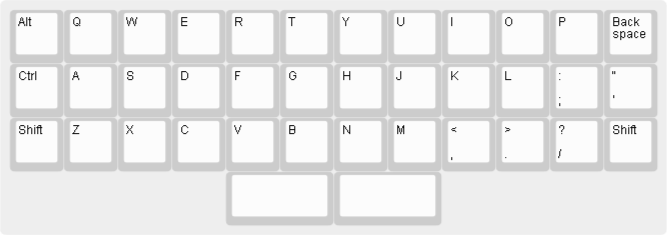
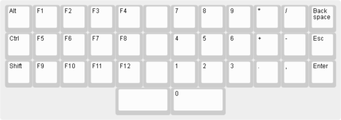
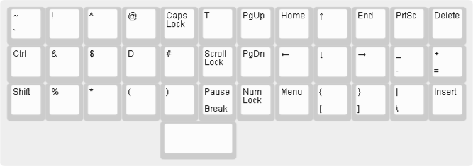
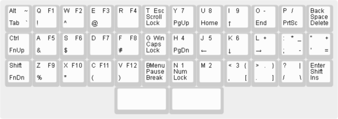

These are the layers of Prism.

# Default

The default layer based on the standard layer of the full size keyboard
or the 60% keyboard. It is almost identical to the Planck keyboard,
only Ctrl and Alt keys moved to the left side of the keyboard
and there is a split space bar on the bottom.

The [default prism layer definition](prism-default.json):

# Raise

The Raise layer introduces function keys F1 - F12,
numbers arranged in a numpad style and sever other
missing keys: Scroll Lock, Caps Lock, Num Lock, Esc, Win and Menu.

The [raise prism layer definition](prism-raise.json):

# Lower

The Lower layer introduces the nav cluster
(arrow keys, PgUp, PgDn, Home, End, Insert, Delete)
two special keys (PrtSc and Pause/Break)

["~\n`","!","^","@","","","","","↑","","",""],
["Ctrl","&","$","","#","","","←","↓","→","_\n-","+\n="],
["Shift","%","*","(",")","","","","{\n[","}\n]","|\n\\",""],
[{x:4,w:2},"",{w:2},""]

The [lower prism layer definition](prism-lower.json):

Complete:

[complete prism layers](prism-complete.json)
