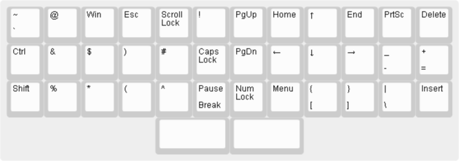

These are the layers of Prism.

# Default

The default layer based on the standard layer of the full size keyboard
or the 60% keyboard. It is almost identical to the Planck keyboard,
only Ctrl and Alt keys moved to the left side of the keyboard
and there is a split space bar on the bottom.

The [default prism layer definition](prism-default.json):

# Raise

The Raise layer introduces function keys F1 - F12,
numbers arranged in a numpad style and six other
of the missing keys: Scroll Lock, Caps Lock, Num Lock, Esc, Win and Menu.

The [raise prism layer definition](prism-raise.json):

# Lower

The Lower layer introduces the nav cluster:
PgUp, PgDn, Home, End, Insert, Delete,
and the arrow keys in the ijkl shape.

The three missing symbol keys to the right of the **P** key
moved to the right of the **M** key,
two keys from number row to the right of the **0** key
moved to the right of the **L** key.

Other symbols from the number row dwell on letters
based on their shapes, for example, the dollar sign **$**
resembles the letter **S**, the asterisk * looks almost like an **X**
and left parenthesis **(** is similar to the letter **C**.
At least this is what they look to me. I hope you get the idea! ;)

Two special keys **PrtSc** sits on **P** and **Pause/Break** on **B**.

The [lower prism layer definition](prism-lower.json):

Complete:

[complete prism layers](prism-complete.json)
