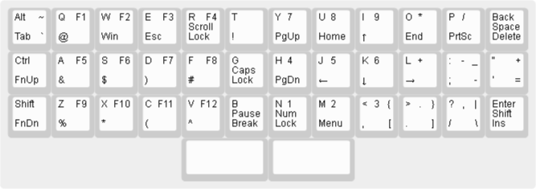

These are the layers of Prism.

# Default

The default layer based on the standard layer of the full size keyboard
or the 60% keyboard. It is almost identical to the Planck keyboard,
only Ctrl and Alt keys moved to the left side of the keyboard
and there is a split space bar on the bottom.

[default prism layer definition](prism-default.json):

Lower:

[lower prism layer](prism-lower.json)

Raise:

[raise prism layer](prism-raise.json)

Complete:

[complete prism layers](prism-complete.json)
